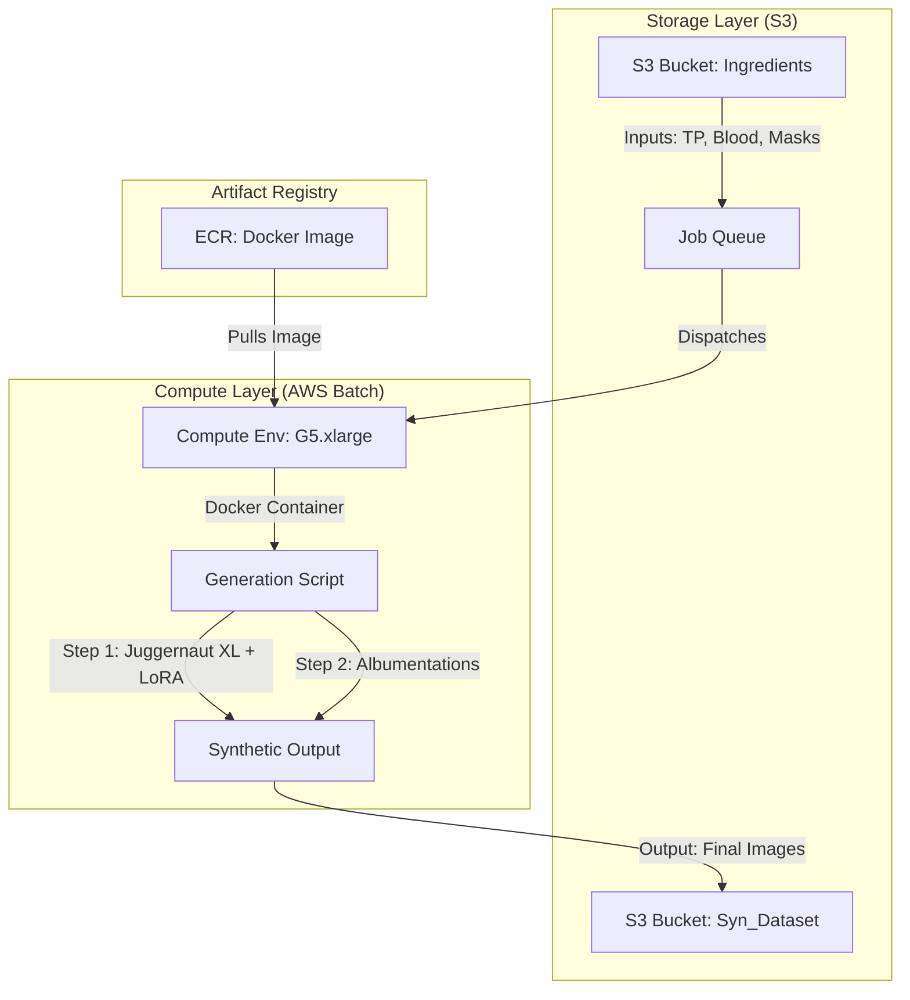

# ColoScreen: Data Acquisition & Synthetic Generation Protocol

> **⚠️ Non-clinical use disclaimer:** ColoScreen is a research pipeline for synthetic image generation and model robustness testing. All labels in this repository represent visual appearance categories only and are not medical diagnoses, triage decisions, or clinical guidance.

##  High-Level Summary

This folder documents the physical data acquisition phase of ColoScreen. While **Tier 1 capture is currently complete**, the full protocol is designed to generate a massive, scientifically controlled dataset to bridge the "Sim-to-Real" domain gap.

Upon completion of all acquisition tiers, this repository will house **25,920 RAW substrate images** and a dedicated library of **116 pathological mimics**.

The pipeline consists of three distinct data streams:

1.  **Component Capture (The "Digital Twins"):**

    * **Volume:** **25,920 RAW images** (Substrates) + **96 Blood** / **20 Stool** variants (Foregrounds).

    * **Purpose:** These isolated assets serve as the raw materials for the programmatic compositing pipeline.

    * **Method:** Combinatorial capture of **45 Toilet Paper types** across 8 geometries and 8 sensors.

2.  **The "Ground Truth" Dataset (The Style Target):**

    * **Volume:** **1,600 RAW Images**.

    * **Content:** Physical mockups of Blood and Stool **actually applied** to Toilet Paper.

    * **Capture:** High-fidelity **Nikon D750** capture only.

    * **Purpose:** This set defines the reference visual style for fluid–paper interaction.

    * **Note:** Exposure fusion is applied *only* to this Ground Truth set to preserve simultaneous highlight (wet glare) and shadow (coagulated regions) detail. Background substrate captures use standard 3-frame bracketing without HDR fusion.

    * **⚠️ DISCLAIMER:** Captured under a single controlled camera/lighting rig to learn the visual style of fluid-on-paper interactions (wicking/edge diffusion) under controlled conditions. It is not intended to model real-world sensor noise or the full range of lighting variability.

3.  **Reference Capture (The Domain Gap):**

    * **Content:** Varied real-world bathroom scenes.

    * **Purpose:** Defines the noise floor, lighting variance, and blur characteristics of smartphone cameras to ensure the synthetic output is robust to bad photography.

---

##  Table of Contents

1.  [Legend & Glossary](#1-legend--glossary)
2.  [ Quick Start: Daily Operational Checklist](#2--quick-start-daily-operational-checklist)
3.  [The Stage: 18% Neutral Gray Background](#3-the-stage-18-neutral-gray-background)
4.  [Calibration & Localization](#4-calibration--localization)
5.  [Lighting Configuration](#5-lighting-configuration)
6.  [Core Acquisition Mandate](#6-core-acquisition-mandate)
7.  [Sensor Calibration & Exposure Protocol](#7-sensor-calibration--exposure-protocol)
8.  [Dataset Architecture](#8-dataset-architecture)
9.  [Capture Protocol: Pathology Layer](#9-capture-protocol-pathology-layer)
10. [Quality Assurance & Calibration Standards](#10-quality-assurance--calibration-standards)
11. [File Naming Convention](#11-file-naming-convention)
12. [Data Processing & Extraction Pipeline](#12-data-processing--extraction-pipeline)
13. [Metadata Schema](#13-metadata-schema-jsoncsv)
14. [Next Steps: Generative Composition](#14-next-steps-generative-composition-pipeline)

---
##  1. Legend & Glossary

| Acronym/Term | Definition |
| :--- | :--- |
| **RAW / DNG / NEF** | Uncompressed image formats. **DNG** (Digital Negative) is Adobe's open format; **NEF** is Nikon's proprietary format. RAW capture is essential for preserving the full dynamic range and color data. |
| **EV (Exposure Value)** | A measurement of the amount of light in an image. **+1 EV** represents a doubling of light; **-1 EV** represents a halving. |
| **LRV (Light Reflectance)** | Light Reflectance Value. A scale from 0 (Black) to 100 (White). **18% Gray** is the industry standard for exposure calibration. |
| **CRI** | Color Rendering Index (0-100). A measure of a light source's ability to reveal the true colors of objects compared to natural sunlight. |
| **Mertens Fusion** | A multi-exposure fusion algorithm that blends bracketed images to create High Dynamic Range (HDR) outputs without the "halo" artifacts typical of tone mapping. |
| **Domain Gap** | The performance drop observed when an AI model trained on synthetic data is tested on real-world data. We minimize this by capturing real-world lighting and sensor noise. |
| **Substrate** | The base material layer (Toilet Paper) onto which the pathology is composited. |
| **Morphology** | The structural shape and form of the biological sample (e.g., pooling, streaking, clotting). |
| **LoRA** | **Low-Rank Adaptation**. A fine-tuning technique for Stable Diffusion that allows the model to learn a specific style (e.g., "blood wicking on paper") without retraining the entire neural network. |
| **SDXL (Juggernaut)** | **Stable Diffusion XL**. A state-of-the-art generative AI model. "Juggernaut" is a specific version fine-tuned for photorealism. |
| **ControlNet** | A neural network structure that allows us to control Stable Diffusion with spatial conditions (like Canny edges or Depth maps), ensuring the generated blood keeps its exact shape. |

---

## 2.  Quick Start: Daily Operational Checklist

Use this checklist at the start of every capture session to ensure data consistency.

### Phase 1: Rig Warm-Up

- [ ] **Lights On:** Power on Neewer LEDs (5600K) 15 minutes prior to shooting (stabilize output).
- [ ] **Clean Stage:** Wipe down White PVC and Gray Boards with microfiber; zero dust allowed.
- [ ] **Position Reference:** Ensure X-Rite ColorChecker is locked in Grid R2C3.
- [ ] **Validate Lux:** Place Sekonic meter on board. Ensure illuminance is stable between **600 - 800 Lux**
- [ ] **Record Temp:** Use **Nubee NUB8380 IR Thermometer** to log surface temperature of the MDF board

### Phase 2: Sensor Dial-In

- [ ] **Select Device:** (e.g., **iPhone 16e**).
- [ ] **Launch App:** Open **Open Camera** (Android) or **Halide** (iOS). **DO NOT** use default camera app.
- [ ] **Meter Scene:** Place Sekonic L-858D-U at center of board (Dome out). Measure incident light.
- [ ] **Lock Settings:** Input the device's fixed aperture (e.g., f/1.6) into Sekonic. Read the required Shutter Speed (T). Set ISO to **100**.

### Phase 3: Capture (The Loop)

- [ ] **Place Sample:** Position TP or Pathology Sample in target Grid Square.
- [ ] **Focus:** Tap to focus (ensure focus peaking is active if available).
- [ ] **Bracket:** Fire the burst (**-1EV, 0EV, +1EV**).
- [ ] **Verify:** Check histogram. Ensure no clipping on whites (TP) or crushing of blacks (Clots).

### Phase 4: Ingestion

- [ ] **Offload:** Transfer RAW files to `Ingest_Folder`.
- [ ] **Rename:** Run batch rename script to match [Naming Convention](#11-file-naming-convention).
- [ ] **Backup:** Mirror to NAS/Cloud immediately.

###  Repository Structure

    Data_Acquisition/
    ├── raw/
    │   ├── backgrounds/          # 25,920 Substrate Images (DNG)
    │   └── foregrounds/          # Blood & Stool Library (NEF)
    ├── processed/
    │   ├── tiff_16bit/           # Intermediate Linear TIFFs
    │   └── final_assets/         # Cropped, Masked, Fusion Results
    ├── scripts/
    │   ├── rename_batch.py       # Naming Convention Automation
    │   └── extract_assets.py     # CV2 Mertens Fusion & Slicing
    └── metadata/
        └── ColoScreen_Metadata.csv

---

## 3. The Stage: 18% Neutral Gray Background

The core of our capture stage consists of two custom-fabricated MDF boards designed to provide a mathematically neutral background for all samples.

* **Board A (Large):** 27" x 24" (Segmented into a **4x4 Grid**)
* **Board B (Small):** 24" x 21" (Segmented into a **3x3 Grid**)

### Material & Coating

Both boards were coated with **2 coats (rolled)** of **Valspar Deco Gray (8006-7D)**. This specific pigment was selected for its precise optical properties. To ensure a perfectly flat, texture-neutral surface, the MDF was prepped with 200-grit sandpaper before the initial coat, followed by a smoothing pass with 400-grit sandpaper between coats.

| **Paint Specification** | **Value** |
| :--- | :--- |
| **Color Name** | Valspar Deco Gray (8006-7D) |
| **Family / Undertone** | Gray / Cool |
| **LRV (Light Reflectance Value)** | **18.0** (Standard Neutral) |
| **RGB** | `112, 119, 122` |
| **HEX** | `#70777a` |

###  Why 18% Gray is the "Gold Standard"

The selection of a paint with an **LRV of 18.0** is critical for three reasons:

1.  **Exposure Anchoring:** Camera light meters are calibrated to "Middle Gray" (Zone V). By using a background that reflects exactly 18% of light, the camera's auto-exposure algorithms produce consistent exposure values across thousands of images, regardless of whether the toilet paper is bright white or unbleached bamboo.
2.  **Spectral Neutrality:** The RGB values (`112, 119, 122`) are nearly balanced, meaning the background reflects Red, Green, and Blue light almost equally. Any deviation in the background color in post-processing indicates a lighting temperature shift, allowing us to mathematically correct white balance with precision.
3.  **Perceptual Middle:** While it reflects 18% of light physics-wise, the human eye (and image sensors) perceives this tone as visually halfway between black and white due to the logarithmic nature of vision. This provides the ideal contrast range for isolating foreground objects without clipping highlights or crushing shadows.

---

## 4. Calibration & Localization

To automate the extraction of samples during the computer vision phase, both boards utilize a fixed coordinate system.

* **Grid System:** The boards are physically marked with a grid (3x3 for Small, 4x4 for Large) to standardize sample placement.
* **Color Ground Truth:** An **X-Rite ColorChecker Passport** is permanently placed in **Grid Position R2C3** (Row 2, Column 3) for every capture session.
    * *Purpose:* This allows us to generate a specific ICC profile for every lighting batch, ensuring that "Red" blood looks exactly the same in our dataset as it does in reality, correcting for any sensor bias.

---

## 5. Lighting Configuration

We utilize a dual-source continuous lighting setup to simulate diffuse, shadow-less restroom lighting while maintaining high CRI (Color Rendering Index) for accuracy.

### Equipment

* **Lights:** 2x Neewer 150W Continuous LED Video Lights (5600K Daylight Balanced).
* **Positioning:** Placed on either side of the stage, **3 feet away** from the center and **4 feet elevated** above the board level. This downward angle mimics overhead ceiling lights found in bathrooms.

### Modifiers (Key & Fill)

To prevent harsh specular highlights on the wet blood samples (which would look like white spots to the AI), we use large softboxes to diffuse the light:

* **Key Light (Main):** **48" Octa Box**. Provides the primary illumination, wrapping soft light around the texture of the toilet paper.
* **Fill Light (Secondary):** **36" Octa Softbox**. Fills in the shadows created by the deep ply/texture of the toilet paper, ensuring the neural network can see into the fiber crevices.

### Summary of Rig Variables

| Variable | Setting/Value | Reason |
| :--- | :--- | :--- |
| **Background Color** | Valspar Deco Gray 8006-7D | Matches 18% Reflectance (Exposure Standard). |
| **Sensors** | X-Rite ColorChecker | Automated color correction via ICC profiles. |
| **Light Temp** | 5600K (Daylight) | Neutral white point to prevent yellow/blue casts. |
| **Light Style** | Continuous LED + Softboxes | High CRI (>96) and diffusion to reduce glare on fluids. |

---

## 6. Core Acquisition Mandate

To ensure the highest fidelity for synthetic generation, a strict data policy is enforced across all capture devices (DSLRs and Mobile).

* **Format:** **RAW Only** (DNG, NEF, or OEM Raw).
* **Zero-Compression Policy:** No JPEG or lossy formats are permitted at the capture stage. This prevents compression artifacts (blocking, ringing) from being "learned" by the CNN/GAN as diagnostic features.
* **Pipeline Consistency:** RAW data allows for a unified white balance and color profile application (Linear/Neutral) during post-processing using RawTherapee.

---

## 7. Sensor Calibration & Exposure Protocol

Mobile devices have fixed apertures (f-stops), unlike DSLR lenses. To maintain a consistent **ISO 100** baseline across all 8 sensors, the Shutter Speed (T) must be recalculated for every device using the **Sekonic Lightmeter 858-D-U**.

### 📋 Sensor Calibration Matrix (ISO 100 Standard)

| ID | Device / Sensor | Native Aperture (f-stop) | ISO Target | Shutter Speed (T) | Note |
| :--- | :--- | :--- | :--- | :--- | :--- |
| **S01** | **Nikon D750 (Reference)** | **f/8.0** | **100** | *Calc via Sekonic* | Set manually to f/8 for optimal sharpness (Sweet Spot). |
| **S02** | **Samsung S10** | **f/1.5 - f/2.4** | **100** | *Calc via Sekonic* | Dual aperture; lock to wide if possible. |
| **S03** | **Samsung S24** | **f/1.7** | **100** | *Calc via Sekonic* | High resolution 200MP sensor. |
| **S04** | **Samsung A10** | **f/1.9** | **100** | *Calc via Sekonic* | Budget sensor control variable. |
| **S05** | **Google Pixel 6** | **f/1.85** | **100** | *Calc via Sekonic* | Computational photography baseline. |
| **S06** | **Motorola Moto G** | **f/1.7** | **100** | *Calc via Sekonic* | Mid-range market representation. |
| **S07** | **iPhone 16e** | **f/1.6** | **100** | *Calc via Sekonic* | Latest generation Apple sensor. |
| **S08** | **Google Pixel 10 Pro** | **f/1.6** | **100** | *Calc via Sekonic* | Latest generation Pixel sensor. |

###   Operational Rules

1.  **Re-Meter Every Change:** Do not assume lighting power is constant. You must re-meter the scene with the Sekonic when switching from Nikon (f/8.0) to iPhone 16e (f/1.6) because the mobile sensor needs significantly less light/time.
2.  **App Enforcement:** You **must** use **Open Camera (Android)** or **Halide (iOS)** to force ISO 100. Native apps will drift to ISO 40-50, breaking calibration.
3.  **Diffraction Warning:** For S01 (Nikon), never stop down past **f/11** to avoid diffraction softening.

---

## 8. Dataset Architecture

The background layer is not a random collection of images. It is a precise **Combinatorial Matrix** designed to cover specific variables found in home bathrooms. The total volume is derived from the table below (sourced from `Workflow Image Computation.xlsx`).

### Layer A: The Substrate (Backgrounds)

**Calculated Total: 25,920 RAW Assets**

| Component | Variable Count | Notes |
| :--- | :--- | :--- |
| **Sensors** | **8** | Nikon, Samsung (x3), Pixel (x2), Moto, iPhone |
| **Lighting** | **3** | Daylight, Warm, Mixed |
| **Brackets** | **3** | **-1EV, 0EV, +1EV** |
| **Geometries** | **8** | Distinct fold/crumple morphologies on Board B |
| **Toilet Papers** | **45** | **Total across 3 Tiers** |

**Breakdown by Tier:**

* **Tier 1:** 20 TPs × 8 Sensors × 3 Lights × 3 Brackets × 8 Geometries = **11,520 Images**
* **Tier 2:** 15 TPs × 8 Sensors × 3 Lights × 3 Brackets × 8 Geometries = **8,640 Images**
* **Tier 3:** 10 TPs × 8 Sensors × 3 Lights × 3 Brackets × 8 Geometries = **5,760 Images**
* **Grand Total:** **25,920 Images**

### Layer B: The Pathology (Foregrounds)

*Derived from Physical Simulation & HDR Capture*

A library of **116 unique, alpha-masked biological mimics** designed to simulate specific gastrointestinal hemorrhage conditions.

**Total Classes: 96 Blood Variants + 20 Stool Variants**

| Class | Materials | Mimics (Medical Condition) |
| :--- | :--- | :--- |
| **Arterial** | Mehron Bright Arterial | **Lower GI Bleed (Hematochezia):** Fresh, oxygenated, rapid loss. |
| **Venous** | Mehron Dark Venous | **Upper/Mid GI Bleed:** Deoxygenated, dark red/purple. |
| **Coagulated** | Mehron Coagulated Gel | **Clots/Thrombosis:** Indicates pooling or active bleeding source. |
| **Latent/Old** | Reel Blood "Old Dried" | **Stains:** Differentiating active bleeds from old sanitary issues. |
| **Transit** | Fleet Street "Drying" | **Smearing:** Simulates drying time and viscosity changes. |
| **Force** | Splatter/Spray | **High Velocity:** Gas expulsion or coughing events. |
| **Stool (Type 3/4)** | Miso + Corn Flour | **Healthy/Normal:** Structured texture (Bristol Scale 3-4). |
| **Stool (Type 5-7)** | Nutella/Pudding | **Diarrhea/Loose:** Lack of fiber, rapid transit. |
| **Melena** | Activated Charcoal | **Upper GI Hemorrhage:** Tarry, black, digested blood. |

---

## 9. Capture Protocol: Pathology Layer

While backgrounds are captured on the Gray Board, the **Blood and Stool library** requires a specialized capture workflow to ensure perfect isolation (masking) and texture retention.

* **Camera:** Nikon D750 (Full Frame) to maximize dynamic range.
* **Surface:** White PVC Board (distinct from the Gray Backgrounds to facilitate high-contrast Luma Masking).
* **Exposure:** **3-Stop Bracketing (-1EV, 0EV, +1EV)**.
* **Processing Strategy (Mertens Fusion):**
    * Fluids are highly reflective (specular highlights) and dark clots are highly absorbent (deep shadows). A single exposure cannot capture both.
    * We utilize **Mertens Exposure Fusion** to combine brackets into a single **16-bit HDR TIFF**. This renders the wet glare as visible white (not blown out) and the clots as textured dark red (not crushed black).

---

## 10. Quality Assurance & Calibration Standards

To guarantee scientific validity and eliminate blur or focus errors, we employ a strict redundancy and verification protocol.

### 10.1 Duplicate Bracket Capture & Laplacian Filtering

For every Pathology (Foreground) variant, the bracket sequence is not captured once, but **twice** (Set A and Set B).

* **Objective:** To automatically detect and discard micro-blurred images caused by camera shake or shutter vibration.
* **Method:**
    1.  Capture **Set A** (3 images).
    2.  Capture **Set B** (3 images).
    3.  Calculate the **Laplacian Variance** (a measure of edge sharpness) on the 0 EV (Midtone) image of both sets.
    4.  The set with the **higher Variance Score** is retained for the HDR Merge; the inferior set is automatically discarded.

### 10.2 Physical Validation Tools

Before any shutter is pressed, the following instruments verify the environment:

* **Exposure Uniformity:** **Sekonic Lightmeter 858-D-U** (Incident metering) verifies lighting is flat across the board (+/- 0.1 EV edge-to-edge).
* **Viscosity Control:** **Infrared Thermometer** records the surface temperature of the board for each shot, as temperature significantly alters fluid dynamics (spread and surface tension).
* **Mobile Capture:** **Open Camera App** (Android) is mandatory for phone-based background capture to ensure RAW output.

---

## 11. File Naming Convention

A rigid naming schema is enforced to ensure the Python extraction scripts can correctly parse the contents of every RAW file without manual inspection. All captures are fixed at **90° (Top-Down)**.

### 11.1 General Structure

`[Sensor]_[TP_Type]_[Variable3]_[Variable4]_[GridLoc]_[BracketStep]_[Counter].ext`

### 11.2 Background Layer (Toilet Paper)

* **Format:** `[Sensor]_[TP]_[Lighting]_[Geometry]_[GridLoc]_[BracketStep]_[Counter].dng`
* **Example:** `iPhone16e_2PlyBamboo_WarmLED_Geo3_R1C1_0EV_0015.dng`
    * **Sensor:** `NikonD750`, `Pixel6`, `iPhone16e` (First position).
    * **TP:** `2PlyBamboo`, `1PlyRecycled`, `CharminUltra` (Second position).
    * **Lighting:** `Day`, `Warm`, `Mix` (Only 3 Conditions).
    * **Geometry:** `Geo1` through `Geo8` (Represents the 8 distinct fold/crumple morphologies on Board B).
    * **BracketStep:** `-1EV`, `0EV`, `+1EV` (Minus 1, Standard, Plus 1).
    * **Counter:** `0001` - `9999` (Unique sequence ID).

### 11.3 Foreground Layer (Blood/Stool)

* **Format:** `FG_[Class]_[VariantID]_[Temp]_[GridLoc]_[BracketStep]_[SetID]_[Counter].nef`
* **Example:** `FG_Arterial_Bright01_24C_R2C2_0EV_SetA_0042.nef`
    * **BracketStep:** `-1EV`, `0EV`, `+1EV` (3-step bracket).
    * **SetID:** `SetA` or `SetB` (Used for Laplacian quality check).

---

## 12. Data Processing & Extraction Pipeline

To ensure the highest quality input for the CV2/Python extraction, we employ a "Develop First, Process Second" workflow.

### 12.1 RawTherapee Workflow (Batch Processing)

Before any Python scripts touch the files, the RAW data is developed using **RawTherapee** to guarantee color consistency.

1.  **Generate Profile (Tool):**
    * Load the "Master" image containing the **X-Rite ColorChecker**.
    * Create a custom `.pp3` processing profile.
    * **Action:** Ensure the **18% Gray Patch** reads as truly neutral (RGB 119,119,119 or equivalent linear value).
2.  **Mandatory Settings:**
    * **Sharpening:** OFF (Unsharp Mask: Unchecked).
    * **Noise Reduction:** OFF (Luminance/Chrominance: 0).
    * **Lens Corrections:** OFF (Distortion/Vignetting: Unchecked).
    * *Reason: We want raw optical flaws preserved for training, not corrected.*
3.  **Apply WB (Batch):**
    * Apply this "Master" `.pp3` profile to the entire batch of images (e.g., all brackets for a specific set).
    * This forces a unified White Balance across the entire dataset, removing sensor-specific color casts.
4.  **Export (16-bit TIFF):**
    * **Format:** Uncompressed TIFF (16-bit).
    * **Color Space:** **Linear Rec.709** or **AdobeRGB** (Linear space is preferred for mathematical compositing).
    * **Reason:** 16-bit depth prevents banding when we later apply heavy contrast curves in the neural network.

### 12.2 Automated Python Extraction (CV2)

Once the RAW files are converted to 16-bit TIFFs, the Python automation takes over.

1.  **Input:** The script scans the folder of processed TIFFs.
2.  **Foreground Processing (Blood/Stool):**
    * **Laplacian QA:** Parses `SetA` and `SetB`, calculates sharpness, and discards the blurry set.
    * **Mertens Fusion:** Merges the 3 TIFF brackets into a single HDR asset.
3.  **Background Processing (Toilet Paper):**
    * **Grouping:** Groups the `-1EV`, `0EV`, and `+1EV` images.
    * **Selection/Stacking:** Selects the best exposure (usually 0EV) or stacks the linear TIFFs to preserve texture range without applying Mertens Fusion (per High Level Summary Note).
4.  **Grid Slicing:** Based on the `[GridLoc]` tag, the script crops the specific 4x4 or 3x3 square.
5.  **Output:** The final, cropped asset is saved to the dataset folder.

---

## 13. Metadata Schema (JSON/CSV)

For every finalized asset in the dataset, a corresponding metadata entry is generated. This allows the Neural Network to be trained with conditional inputs or for error analysis (e.g., "Show me all failures on Pixel 6 sensors in Warm lighting").

The schema matches the `ColoScreen_Metadata_Template.csv` structure.

| Field | Type | Description |
| :--- | :--- | :--- |
| **Image_ID** | `UUID` | Unique 128-bit identifier for the processed asset. |
| **Source_Filename** | `String` | Original RAW filename (traceability to backup). |
| **Layer_Type** | `Categorical` | `Background` (Substrate) or `Foreground` (Pathology). |
| **Sensor_ID** | `String` | `NikonD750`, `Pixel6`, `iPhone16e`, `Pixel10Pro`, etc. |
| **Lighting_Condition** | `Categorical` | `Day`, `Warm`, `Mix`. |
| **Substrate_Texture** | `String` | `2PlyBamboo`, `1PlyRecycled`, `CharminUltra`, etc. |
| **Geometry_Class** | `String` | `Geo1` - `Geo8` (Fold morphology) or `Flat` (Board A). |
| **Pathology_Class** | `String` | `Arterial`, `Venous`, `Clot`, `StoolT3`, `Melena`, `N/A`. |
| **Viscosity_Temp_C** | `Float` | Surface temperature at capture (affects fluid spread). |
| **Laplacian_Score** | `Float` | The variance score of the retained bracket (Quality Metric). |
| **Bracket_EV** | `String` | Exposure value of the base frame (`0EV`). |
| **Capture_Timestamp** | `Datetime` | ISO 8601 Timestamp of original RAW creation. |
| **Fusion_Method** | `String` | `Mertens_3Frame` or `None` (for Backgrounds). |

---

## 14. Next Steps: Generative Composition Pipeline

Upon completion of the physical acquisition and extraction (Sections 1–13), the project transitions to **Phase 2: Generative Augmentation**. The objective is to seamlessly blend the high-fidelity pathology assets onto the substrate assets while injecting real-world camera noise and lighting artifacts.

We utilize a node-based generative AI workflow to achieve photorealism.

### 14.1 The Engine: Stable Diffusion XL (Juggernaut XL)

We employ **Juggernaut XL**, a fine-tuned checkpoint of Stable Diffusion XL known for extreme photorealism. Unlike standard models, Juggernaut XL excels at texture synthesis (paper fibers) and lighting interaction (subsurface scattering of blood).

### 14.2 The Orchestrator: ComfyUI

The compositing pipeline is built within **ComfyUI**, allowing for precise, modular control over the generation process.

* **Workflow:** Background Image Load -> Foreground Composite (Python Masking) -> Latent Encoding -> SDXL Sampler -> Decode.

### 14.3 Stylistic Alignment: LoRA Training

To bridge the "Sim-to-Real" gap, a **Low-Rank Adaptation (LoRA)** model is trained on the "Ground Truth" dataset (the 1,600 physical mockups from Nikon D750).

* **Goal:** The LoRA biases the Juggernaut model to output images that mimic the realistic wicking, absorption, and drying characteristics of real blood on paper, which simple 2D overlays cannot achieve.

### 14.4 Structural Integrity: ControlNet

To ensure morphology and label integrity, we cannot allow the AI to "hallucinate" the shape of the blood. We must strictly preserve the morphology of the physical mimics captured in Section 9.

* **Implementation:** We utilize **ControlNet (Canny or Depth)**.
* **Function:** ControlNet takes the alpha mask of the extracted blood asset and forces Stable Diffusion to generate the blood *only* within those specific boundaries. This ensures that a "Type 4 Clot" remains a "Type 4 Clot" while the AI handles the realistic blending of edges into the toilet paper fibers.

### 14.5 Compositing Strategy & Sampling

To ensure the model generalizes across diverse user conditions, we employ a **Stratified Random Sampling** strategy for combining foregrounds (Pathology) and substrates (Backgrounds).

* **Logic:** Foregrounds are paired with backgrounds by strictly matching Sensor, Lighting, and Geometry classes (e.g., overlaying *Arterial Blood* specifically onto a *Pixel 6 / Warm Light / Geometry 3* background). This ensures the domain gap coverage scales combinatorially.
* **Weighted Tier Sampling:** The composition process follows a strict distribution to balance common scenarios with edge cases:
    * **60% Tier 1:** Core, all-encompassing baseline (20 TPs covers major brands, ply, type and texture).
    * **30% Tier 2:** Expanded material/texture/color coverage beyond Tier 1.
    * **10% Tier 3:** Edge cases, poor quality toilet papers.
* **Curriculum:** This tier system enables a "Curriculum Learning" approach (progressing from easy to hard examples), which is detailed in the Phase 2 documentation.

 ### 14.6 Cloud Architecture (AWS / S3)

---
##  AI Assistance Disclosure
  
This README was prepared with the assistance of an AI agent to enhance structure, clarity, and technical documentation quality. All project code, architecture, and experimental results were implemented, and verified by me without any AI use. I provided the outline, structure and content for this ReadME and the AI assistant was used exclusively for documentation, drafting, formatting, and summarization purposes.

