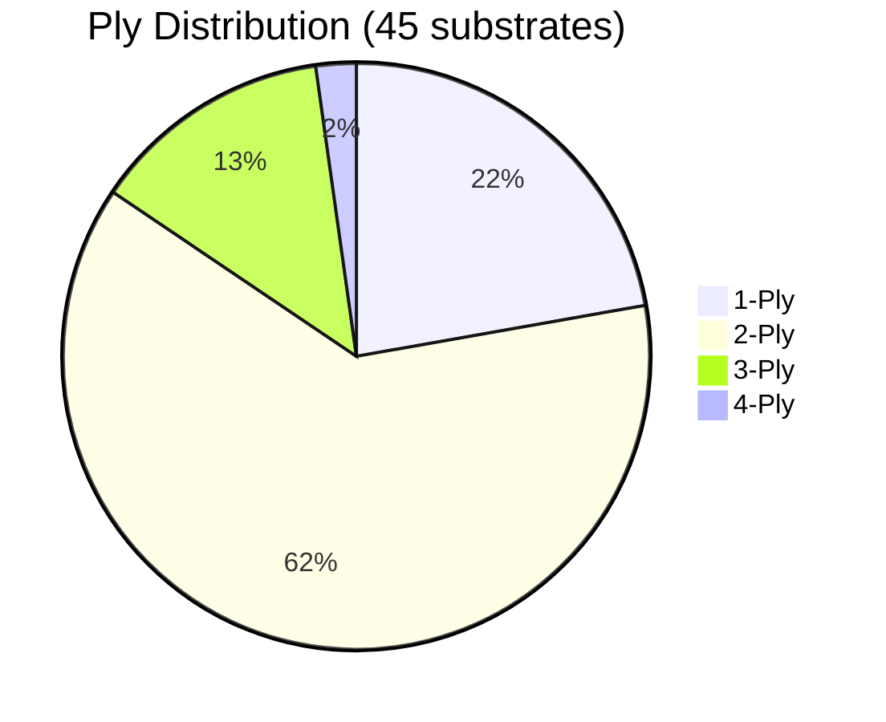

# 🧻 Toilet Paper Background Dataset  
## Selection, Stratification, and Capture Rationale 

---

## 1. Executive Summary

The ColoScreen Toilet Paper Background Dataset consists of **45 distinct toilet paper substrates**, selected and stratified using a **texture-first, failure-mode–driven methodology**.

No synthetic balancing, inferred market data, or external assumptions were introduced.

The objective is to ensure downstream CNN and generative models **cannot rely on background shortcuts**, emboss signatures, or brand-specific fiber artifacts when detecting blood and stool morphology.

---

## 2. Design Principle: Substrate as a First-Class Variable

Toilet paper is treated as an **optical and physical medium**, not a neutral background.

Substrates were chosen to span controlled variation in:

- Ply-driven opacity
- Emboss depth and spatial frequency
- Fiber regularity vs irregularity
- Surface chemistry (lotion vs untreated)
- Base coloration (white vs off-white / recycled)

This prevents models from learning:
- Brand-locked texture priors  
- Repeating emboss motifs  
- Absorption shortcuts tied to a single fiber class  

---

## 3. Tier System (Authoritative)

The **45 substrates** are divided into **three tiers**, with each tier serving as a **non-overlapping technical role**.

---

### 3.1 Tier 1 — Structural Anchors

 **Role:** Define the  **core optical and physical**  texture anchors the model must normalize against, along with primary failure-mode baselines.

**Rationale**
- Highly engineered, repeatable emboss geometry
- Strong structural noise that must be ignored by the model
- Anchor the primary decision boundary for blood vs non-blood morphology

**Observed properties**
- Deep quilted or cloud emboss
- Dense, high-frequency repeating patterns
- Lotion-treated and non-treated variants
- Consistent fiber alignment

Failure on Tier 1 indicates the model is learning **texture instead of morphology**.

| # | Sample Code | Brand / Type | Ply | Primary Rationale |
|---|---|---|---|---|
| 1 | SCOT_STR_1 | Scott 1000 | 1 | **Texture Floor.** Universal baseline for thin, flat 1-ply. Essential for learning translucency and rapid saturation. |
| 2 | QNOR_PLU_3 | Quilted Northern Ultra Plush | 3 | **Texture Ceiling.** Thickest common 3-ply; critical for deep liquid pooling and high loft. |
| 3 | QNYA_UNB_4 | Qing Ya | 4 | **Color Outlier.** Only 4-ply unbleached (tan/beige) sample; ensures robustness on non-white backgrounds. |
| 4 | REEL_BAM_3 | Reel Paper | 3 | **Material Variance (Bamboo).** Distinct bamboo fiber structure and sheen vs wood pulp. |
| 5 | EVSP_REC_2 | Ever Spring (Target) | 2 | **Material Variance (Recycled).** Noisy/grainy texture typical of recycled fibers. |
| 6 | COTN_CMF_2 | Cottonelle Ultra Comfort | 2 | **Geometric Texture (Ripples).** Unique wavy ripple pattern creating distinct flow paths. |
| 7 | CHRM_SFT_2 | Charmin Ultra Soft | 2 | **Surface Topology (Cloud).** Fuzzy, undefined surface distinct from rigid emboss. |
| 8 | CHRM_STR_2 | Charmin Ultra Strong | 2 | **Deep Emboss Pockets.** Tight, deep pockets distinct from Ultra Soft. |
| 9 | WGAC_SNS_2 | Who Gives A Crap | 2 | **Grid Pattern / Eco.** Distinct grid-like emboss absent in major store brands. |
|10 | ARIA_REC_3 | ARIA Recycled | 3 | **Visible Fiber Fragments.** Industrial recycled pulp with color noise. |
|11 | DOLR_SNS_2 | Dollar Store | 2 | **Irregularity / Quality Noise.** High variance in fiber density and hole defects. |
|12 | CABO_BAM_2 | Caboose Bamboo | 2 | **Alt Bamboo Texture.** Bamboo variation for cross-reference against Reel Paper. |
|13 | CHRM_ESS_1 | Charmin Essentials | 1 | **Budget 1-Ply.** Denser, flatter 1-ply vs Scott 1000. |
|14 | COTN_CLN_1 | Cottonelle Clean | 1 | **1-Ply Ripple.** Ripple texture without backing ply; high bleed-through. |
|15 | T365_REC_2 | Whole Foods Recycled | 2 | **Tan / Rough Recycled.** Browner, rougher recycled texture vs Ever Spring. |
|16 | QNOR_SNS_2 | Quilted Northern | 2 | **Dense Quilted Variant.** Standard diamond quilt distinct from Plush. |
|17 | AMZN_STR_2 | Amazon Presto | 2 | **Uniform Dot Pattern.** Mechanical, uniform emboss distinct from grocery brands. |
|18 | CHRM_ESS_2 | Charmin Essentials | 2 | **Economy / Fuzzy Surface.** Budget floor for premium brands. |
|19 | KIRK_SNS_2 | Kirkland | 2 | **Wide Sheet / Generic Plush.** Definitive bulk-standard warehouse texture. |
|20 | ANGL_SNS_2 | Angel Soft Soft & Strong | 2 | **Standard 2-Ply Baseline.** Mid-range softness reference. |

---

### 3.2 Tier 2 — Variance Amplifiers

 
**Role:** Near-duplicate stressors to expose shortcut learning and memorization.

**Rationale**
- Substrates visually similar to Tier 1 at first glance
- Subtle changes in emboss depth, ply compression, or fiber blend
- Designed to test generalization, not recognition

**Observed properties**
- Shallower emboss variants
- Store-brand equivalents of Tier 1 textures
- Slightly altered absorbency and ridge geometry

Tier 2 is where **overfitting becomes measurable**.

| # | Sample Code | Brand / Type | Ply | Primary Rationale |
|---|---|---|---|---|
| 1 | CHRM_GNT_2 | Charmin Gentle | 2 | **Lotion Finish.** Surface coating alters specularity and absorption. |
| 2 | SCOT_CMF_1 | Scott Comfort Plus | 1 | **Textured 1-Ply.** 1-ply thickness with 2-ply-style emboss. |
| 3 | WLGN_SUP_2 | Walgreens Super Soft | 2 | **Butterfly Emboss.** Distinct soft emboss geometry. |
| 4 | ALDI_STR_1 | Aldi Willow 1000 | 1 | **Deep Discount 1-Ply.** Extreme budget thinness. |
| 5 | HDXX_SNS_2 | HDX (Home Depot) | 2 | **Industrial / Yellow Cast.** Rawer pulp with color bias. |
| 6 | MMBR_SNS_2 | Member's Mark | 2 | **Club Brand Variant.** Sam’s Club analog to Kirkland. |
| 7 | T365_SUS_2 | 365 Bath Tissue | 2 | **Eco-Standard Baseline.** Control for non-recycled eco paper. |
| 8 | TJOS_ULT_2 | Trader Joe’s Bath Tissue | 2 | **Stiff / Crunchy Texture.** Alters absorption vs splatter. |
| 9 | UPUP_STR_1 | Up & Up 1000 | 1 | **Store Brand 1-Ply.** Denser 1-ply alternative. |
|10 | UPUP_STR_2 | Up & Up (Target) | 2 | **Stiff / Dense Weave.** Notably firmer structure. |
|11 | WMGV_SNS_2 | Great Value Soft & Strong | 2 | **Mass-Market Bestseller.** High-exposure baseline. |
|12 | SGEN_REC_2 | Seventh Generation Recycled | 2 | **Premium Eco Recycled.** Tan, rough, unbleached. |
|13 | CVSH_SFT_2 | CVS Total Home Ultra Soft | 2 | **Drugstore Soft Variant.** Pharmacy brand texture. |
|14 | TJOS_SFT_2 | Trader Joe’s Super Soft | 2 | **Subtle Soft Emboss.** Premium grocery virgin pulp. |
|15 | AMZN_SFT_2 | Amazon Presto Ultra Soft | 2 | **E-Commerce Soft Variant.** Online-only quality reference. |

---

### 3.3 Tier 3 — Failure-Mode Discovery

 
**Role:** Budget, edge-case, and format stressors defining operational limits.

**Rationale**
- Substrates that violate assumptions learned from Tier 1 and Tier 2
- Common in real-world usage but underrepresented in controlled datasets

**Observed properties**
- Recycled or bamboo fiber irregularity
- Non-white base coloration
- High lint / particulate noise
- Extreme thinness or stiffness
- Inconsistent emboss registration

Tier 3 defines **operational limits**, not accuracy targets.

| # | Sample Code | Brand / Type | Ply | Primary Rationale |
|---|---|---|---|---|
| 1 | ALDI_SNS_2 | Aldi Willow Ultra Soft & Strong | 2 | **Discount 2-Ply Baseline.** Mass-market budget quality. |
| 2 | ALDI_STR_2 | Aldi Willow Ultra Strong | 2 | **Discount Strong Emboss.** Deep budget emboss pattern. |
| 3 | BLKW_ULT_2 | Black and White | 2 | **Minimal Processing.** Discount brand baseline. |
| 4 | CVSH_BAS_1 | CVS Just the Basics | 1 | **Drugstore Budget 1-Ply.** |
| 5 | CVSH_STR_2 | CVS Total Home Ultra Strong | 2 | **Drugstore Strong Variant.** |
| 6 | DEAL_ULT_2 | Deal Worthy | 2 | **Ultra-Budget Discount.** Low-end texture. |
| 7 | MOXE_SFT_2 | Moxie Ultra Soft | 2 | **Independent Brand.** Alternative soft texture. |
| 8 | WLGN_SFT_2 | Walgreens Soft | 2 | **Pharmacy Store Brand.** |
| 9 | WLGN_ULT_1 | Walgreens Big Roll | 1 | **Extended Length Format.** 1-ply big roll. |
|10 | DOLR_BAS_1 | Dollar Store 1000 Sheets | 1 | **Ultra-Budget 1-Ply.** Extreme low-end texture. |

---

## 4. Ply Distribution (Verified Ground Truth)

Ply is treated as an **opacity and density variable**, not a marketing label.

| Ply | Technical Effect |
|---|---|
| 1-Ply | High transparency, background bleed-through, edge ambiguity |
| 2-Ply | Primary real-world operating regime |
| 3-Ply | Deep emboss pockets and shadow pooling |
| 4-Ply | Maximum density; limit-test for opacity |

The dataset intentionally emphasizes **2-ply coverage**, with controlled representation of thinner and thicker extremes.

---

### Ply Distribution Visualization

The dataset emphasizes 2-ply (real-world norm), with controlled representation of extremes.

---

## 5. Texture & Fiber Classes

All 45 substrates map into one or more of the following classes:

- **Cloud / Fluffy Quilted** – Broad peaks, diffuse highlights  
- **Deep Emboss / Diamond** – Sharp ridges, strong shadow wells  
- **Dense Quilted** – High-frequency repetitive patterns  
- **Rippled / Directional** – Linear ridges influencing capillary flow  
- **Smooth / Minimal** – Low texture, high contrast reliance  
- **Recycled / Bamboo** – Irregular fiber noise and color shift  

These classes force the model to learn **blood morphology, not surface art**.

---

## 6. Morphological Geometry Coverage (Geo1–Geo8)

Each substrate is captured across **eight physical states**, consistent across tiers.

| Geometry | Purpose |
|---|---|
| Flat | Baseline texture and wicking |
| Double Fold | Moderate density and shadow complexity |
| Quad Fold | High density; common user preparation |
| Light Crumple | Peak/valley highlight distribution |
| Torn + Crumpled | Edge confusion vs clot margins |
| Balled | 3D depth and focus stress |
| Folded / Twisted | Directional distortion |
| Wet / Saturated | Fiber collapse and translucency shift |

This prevents assumptions of ideal presentation geometry.

---

## 7. Known Confounders (Explicitly Modeled)

- **Wicking Rate Variance** – especially in bamboo and recycled fibers  
- **Structural Noise** – emboss patterns resembling organic boundaries  
- **Surface Treatments (Lotion)** – beading vs soak-in behavior
- **Substrate Albedo & Chromaticity** – High-variance base colors (Bleached White vs. Unbleached Tan/Gray).
- **Substrate Translucency** – variance in light transmission (1-ply vs. 3-ply) that allows 18% Gray background color to influence the perceived substrate base.

These cofounders are intentionally included, not filtered out.

---

## 8. Acquisition Controls

- **Background:** 18% Neutral Gray board  
- **Roll Neutralization:** First 3 sheets discarded  
- **Color Calibration:** X-Rite ColorChecker per session  
- **Lighting:** Dual softbox, Sekonic-verified  
- **Capture Order:** Dry → Blood → Stool → Blood+Stool  

All substrates follow the same protocol to eliminate capture bias.

---

## 9. Why This Dataset Works

Because tiering, ply distribution, and texture coverage reflect the broad market availability:

- Models cannot infer class from brand texture
- Robustness is enforced on recycled and thin substrates
- Morphology is learned invariant to folding and damage
- Generalization extends beyond lab conditions

Toilet paper is therefore modeled correctly as a **first-class optical variable**, not background noise.

---
##  AI Assistance Disclosure
  
This README was prepared with the assistance of an AI agent to enhance structure, clarity, and technical documentation quality. All project code, architecture, and experimental results were implemented and verified independently, with the AI used exclusively for documentation, drafting, formatting, and summarization.
